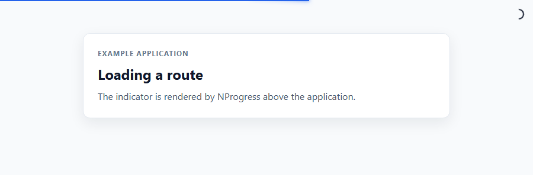
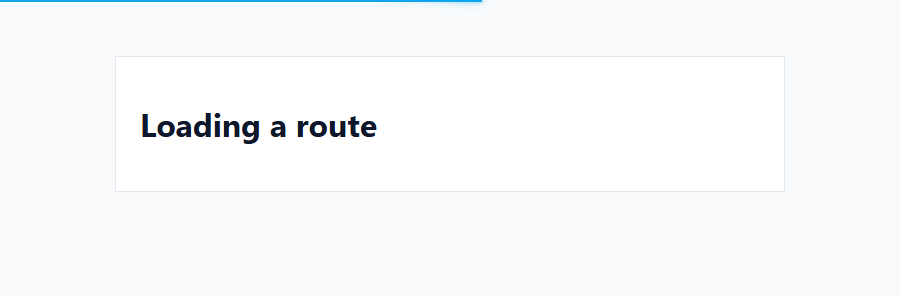
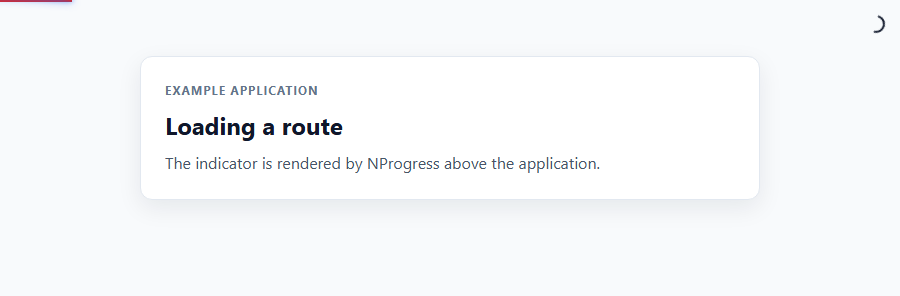

# NProgress

NProgress is a slim, dependency-free progress indicator for browser
applications. Use it while a page loads, a route changes, or an asynchronous
operation is in flight.

## What it looks like

The images below are captured from the included browser fixture using the
published `nprogress.js` and `nprogress.css` files. GitHub selects the dark
variant when the reader uses dark mode.

### Determinate progress

<picture>
  <source media="(prefers-color-scheme: dark)" srcset="docs/output-determinate-dark.png">
  
</picture>

### Indeterminate progress

<picture>
  <source media="(prefers-color-scheme: dark)" srcset="docs/output-indeterminate-dark.png">
  
</picture>

### Failure state

<picture>
  <source media="(prefers-color-scheme: dark)" srcset="docs/output-failure-dark.png">
  
</picture>

## Install

```sh
npm install nprogress
```

With a module bundler:

```js
import NProgress from 'nprogress';
import 'nprogress/nprogress.css';
```

For direct browser use, load the published files:

```html
<link rel="stylesheet" href="nprogress.css">
<script src="nprogress.js"></script>
```

The package is safe to import during SSR. Call DOM methods only after a
browser document is available.

## Usage

Start and finish around an asynchronous operation:

```js
NProgress.start();

fetch('/api/data')
  .finally(() => NProgress.done());
```

Set a known percentage or increment the current value:

```js
NProgress.set(0.4);
NProgress.inc();
NProgress.done();
```

Track a promise, thenable, or jQuery Deferred:

```js
NProgress.promise(fetch('/api/data'));
```

Use `cancel()` for an aborted operation and `fail()` when the indicator should
remain visible as a failure:

```js
NProgress.start().fail();
NProgress.cancel();
```

## API

| Method | Description |
| --- | --- |
| `start()` | Starts the indicator and automatic trickling. |
| `done(force)` | Completes and removes it; `force` renders it when idle. |
| `set(progress)` | Sets a value from `0` to `1`; `1` completes it. |
| `inc(amount)` | Increases by a specified or realistic random amount. |
| `promise(value)` | Tracks a promise, thenable, or jQuery Deferred. |
| `cancel()` | Removes the indicator and resets its state. |
| `fail(force)` | Keeps the indicator visible with failure styling. |
| `pause()` / `resume()` | Pauses or resumes automatic trickling. |
| `configure(options)` | Updates the indicator settings. |
| `on(event, handler)` / `off(...)` | Manages lifecycle event handlers. |

`render()`, `remove()`, `isStarted()`, `isRendered()`, and `status` are also
available for integrations that need direct state or DOM control.

## Configuration

```js
NProgress.configure({
  barColor: '#2563eb',
  spinnerColor: '#0f172a',
  failureColor: '#dc2626',
  height: '3px',
  zIndex: 2000,
  delay: 120,
  parent: '#app'
});
```

| Option | Default | Description |
| --- | --- | --- |
| `minimum` | `0.08` | Initial progress value. |
| `maximum` | `0.994` | Ceiling used by `inc()`. |
| `easing` | `'linear'` | CSS transition easing. |
| `speed` | `200` | Transition duration in milliseconds. |
| `trickle` | `true` | Automatically increments while active. |
| `trickleSpeed` | `200` | Delay between automatic increments. |
| `delay` | `0` | Delay before the indicator is rendered. |
| `showBar` | `true` | Shows the progress bar. |
| `showSpinner` | `true` | Shows the spinner. |
| `barColor` | `null` | Bar color CSS value. |
| `spinnerColor` | `null` | Spinner color CSS value. |
| `failureColor` | `null` | Failure-state bar color CSS value. |
| `height` | `'2px'` | Bar height. |
| `zIndex` | `1031` | Bar and spinner stacking order. |
| `indeterminate` | `false` | Uses an animated indeterminate bar. |
| `rtl` | `false` | Renders progress from right to left. |
| `ariaLabel` | `'Loading'` | Accessible label for the progress bar. |
| `parent` | `'body'` | CSS selector or DOM element receiving the indicator. |

## Navigation events

Connect NProgress to a navigation library with standard DOM listeners:

```js
document.addEventListener('turbolinks:click', () => NProgress.start());
document.addEventListener('turbolinks:render', () => NProgress.done());

document.addEventListener('pjax:start', () => NProgress.start());
document.addEventListener('pjax:end', () => NProgress.done());
```

## Accessibility and customization

The default template uses `role="progressbar"`, `aria-valuemin`,
`aria-valuemax`, and `aria-valuenow`. The spinner is hidden from assistive
technology, and reduced-motion preferences disable its animation.

Custom templates must include an element matching `barSelector`. Templates are
inserted as HTML; never pass untrusted input to `template`.

## Support and development

The maintained browser target is current Chromium, Firefox, and WebKit. Node.js
18 or newer is supported for package imports and SSR.

See [MIGRATION.md](MIGRATION.md) for changes from NProgress 0.2.0 and
[CONTRIBUTING.md](CONTRIBUTING.md) for development and verification commands.

## License

NProgress is released under the [MIT License](License.md).
