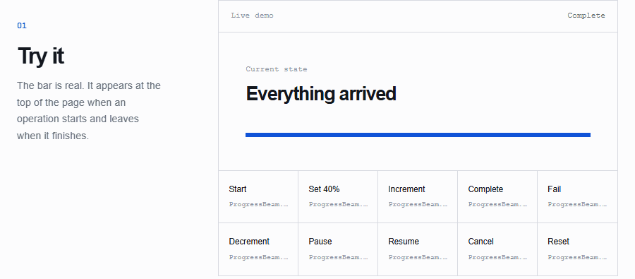
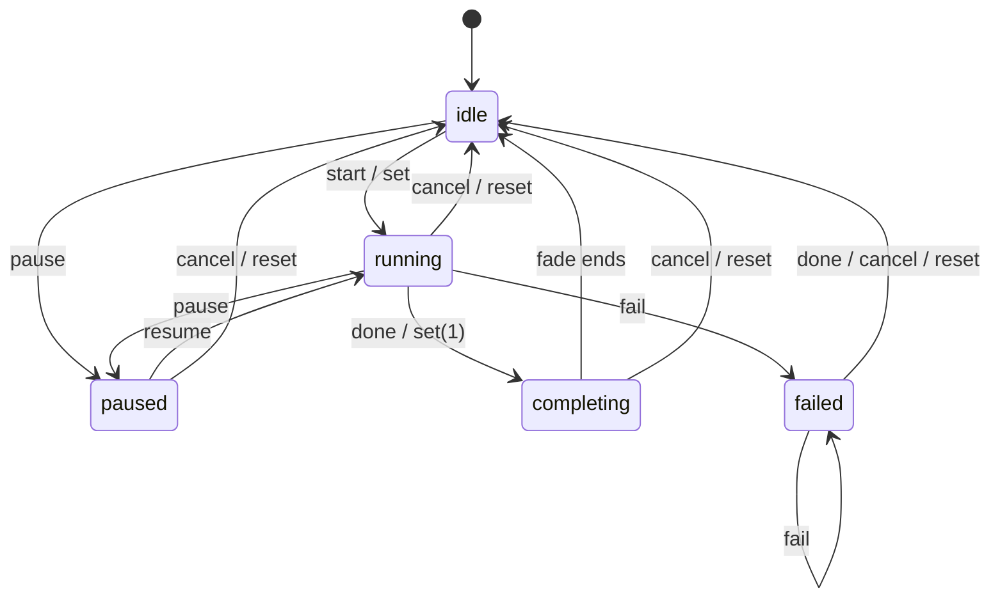

# ProgressBeam

ProgressBeam is a slim, dependency-free progress indicator for browser
applications. Use it while a page loads, a route changes, or an asynchronous
operation is in flight.

- Zero runtime dependencies; ESM, CommonJS, and direct-browser builds
- TypeScript declarations with type-tested public API
- Valid `progressbar` semantics, labeled status, reduced-motion support
- Lifecycle events plus explicit fail, cancel, pause, and reset
- Framework adapters for fetch, routers, React, Next.js, Vue, TanStack
- Verified in real Chromium/Firefox/WebKit with enforced size budgets

## See it in motion

Captured from the published runtime moving through progress, pause,
failure, reset, and completion. GitHub selects the dark variant when the
reader uses dark mode.

<picture>
  <source media="(prefers-color-scheme: dark)" srcset="docs/output-demo-dark.gif">
  
</picture>

## Install

```sh
npm install progressbeam
```

With a module bundler:

```js
import ProgressBeam from 'progressbeam';
import 'progressbeam/progressbeam.css';
```

For direct browser use, load the published files:

```html
<link rel="stylesheet" href="progressbeam.css">
<script src="progressbeam.js"></script>
```

Safe to import during SSR; see Content Security Policy and SSR.

## Usage

Start and finish around an asynchronous operation:

```js
ProgressBeam.start();

fetch('/api/data')
  .finally(() => ProgressBeam.done());
```

Set a known percentage or increment the current value:

```js
ProgressBeam.set(0.4);
ProgressBeam.inc();
ProgressBeam.done();
```

Track a promise, thenable, or jQuery Deferred:

```js
ProgressBeam.promise(fetch('/api/data'));
```

Use `cancel()` for an aborted operation and `fail()` when the indicator should
remain visible as a failure:

```js
ProgressBeam.start().fail();
ProgressBeam.cancel();
```

## API

| Method | Description |
| --- | --- |
| `start()` | Starts the indicator and automatic trickling. |
| `done(force)` | Completes and removes it; `force` renders it when idle. |
| `set(progress)` | Sets a value from `0` to `1`; `1` completes it. |
| `inc(amount)` | Increases by a specified or scheduled random amount. |
| `dec(amount)` | Decreases by a specified or scheduled amount; no-op while idle. |
| `reset()` | Removes the indicator and restores idle model and default settings. |
| `promise(value)` | Tracks a promise, thenable, or jQuery Deferred. |
| `cancel()` | Removes the indicator and resets its state. |
| `fail(force)` | Keeps the indicator visible with failure styling. |
| `pause()` / `resume()` | Pauses or resumes automatic trickling. |
| `configure(options)` | Updates the indicator settings. |
| `on(event, handler)` / `off(...)` | Manages lifecycle event handlers. |

`render()`, `remove()`, `reset()`, `isStarted()`, `isRendered()`, and
`status` are also available for integrations that need direct state or
DOM control.

## Lifecycle



`start()` and `set()` move out of idle; `done()` runs the completion fade;
`fail()` holds the visible failure state; `cancel()` and `reset()` return
to idle immediately, with `reset()` also restoring default settings.

## Configuration

```js
ProgressBeam.configure({
  barColor: '#2563eb',
  spinnerColor: '#0f172a',
  failureColor: '#dc2626',
  height: '3px',
  zIndex: 2000,
  delay: 120,
  parent: '#app'
});
```

| Option | Default | Description |
| --- | --- | --- |
| `minimum` | `0.08` | Initial progress value. |
| `maximum` | `0.994` | Ceiling used by `inc()`. |
| `easing` | `'linear'` | CSS transition easing. |
| `speed` | `200` | Transition duration in milliseconds. |
| `trickle` | `true` | Automatically increments while active. |
| `trickleSpeed` | `200` | Delay between automatic increments. |
| `delay` | `0` | Delay before the indicator is rendered. |
| `showBar` | `true` | Shows the progress bar. |
| `showSpinner` | `true` | Shows the spinner. |
| `barColor` | `null` | Bar background; any CSS value, gradients included. |
| `spinnerColor` | `null` | Spinner color CSS value. |
| `failureColor` | `null` | Failure-state bar color CSS value. |
| `height` | `'2px'` | Bar height. |
| `zIndex` | `1031` | Bar and spinner stacking order. |
| `indeterminate` | `false` | Uses an animated indeterminate bar. |
| `rtl` | `false` | Renders progress from right to left. |
| `position` | `'top'` | Bar placement: `'top'` or `'bottom'`. |
| `spinnerPosition` | `'top-right'` | Spinner corner: top/bottom + left/right. |
| `positionUsing` | `''` (auto) | Bar animation: transform, margin, or width. |
| `ariaLabel` | `'Loading'` | Accessible label for the progress bar. |
| `parent` | `'body'` | CSS selector or DOM element receiving the indicator. |

## Navigation events

Connect ProgressBeam to a navigation library with standard DOM listeners:

```js
document.addEventListener('turbolinks:click', () => ProgressBeam.start());
document.addEventListener('turbolinks:render', () => ProgressBeam.done());

document.addEventListener('pjax:start', () => ProgressBeam.start());
document.addEventListener('pjax:end', () => ProgressBeam.done());
```

## Framework adapters

Zero-dependency helpers ship under `progressbeam/adapters/*` (ESM only).
Framework peers are required only by the adapter that uses them:

```js
// Vanilla: track fetch() calls (no peers)
import { createFetchTracker } from 'progressbeam/adapters/history';
const trackedFetch = createFetchTracker(ProgressBeam);
await trackedFetch('/api/data');

// Vanilla: router guards (vue-router compatible)
import { bindRouterGuards } from 'progressbeam/adapters/history';
const unbind = bindRouterGuards(router, ProgressBeam);

// React (peer: react)
import { useProgressBeam } from 'progressbeam/adapters/react';
useProgressBeam(isLoading);

// Next.js App Router (peer: react)
import { createAppRouterTracker } from 'progressbeam/adapters/next';
const tracker = createAppRouterTracker(ProgressBeam);
tracker.finish(usePathname()); // inside an effect keyed on the pathname

// Vue (peer: vue)
import { useProgressBeam } from 'progressbeam/adapters/vue';
useProgressBeam();

// TanStack Router (no runtime dependency)
import { bindTanStackRouter } from 'progressbeam/adapters/tanstack';
const unbind = bindTanStackRouter(router, ProgressBeam);
```

## Accessibility and customization

The default template uses `role="progressbar"`, `aria-valuemin`,
`aria-valuemax`, and `aria-valuenow`. The spinner is hidden from assistive
technology, and reduced-motion preferences disable its animation.

Custom templates must include an element matching `barSelector`. Templates are
inserted as HTML; never pass untrusted input to `template`.

## Content Security Policy and SSR

The package is safe to import during SSR: without a `document` only the
status model advances, and `render()` returns `null`. Call DOM methods after
a browser document is available.

CSP notes:

- `script-src`: the distributed files are static scripts with no `eval` or
  `new Function` (enforced by the source-hygiene suite), so they can be
  allow-listed or hashed like any first-party script.
- `style-src`: bar positioning is applied through element styles at runtime,
  so a strict `style-src` policy needs `'unsafe-inline'` for the indicator to
  animate. The stylesheet itself is a static file.
- `template` is assigned via `innerHTML`; treat it as trusted markup only.
- No `<style>` elements are injected at runtime, so no nonce plumbing is needed.

## How it compares

- **NProgress 0.2.0** (unmaintained): ProgressBeam keeps its API and fixes the ARIA roles, adds ESM/TypeScript/SSR support, and ships the requested delay, indeterminate, RTL, pause, failure, and event features.
- **topbar 3.x** (canvas-based, ~2 KB): smaller, but no types, no ESM, no accessibility semantics, no spinner, and no indeterminate, failure, or event support.
- **@bprogress/core 1.x** (TypeScript): the closest rival. ProgressBeam adds valid ARIA with reduced-motion handling, lifecycle events, fail/cancel/reset, TanStack and fetch adapters, real-browser tests, size budgets, and provenance releases.

## Support and development

The maintained browser target is current Chromium, Firefox, and WebKit. Node.js
18 or newer is supported for package imports and SSR.

See [MIGRATION.md](MIGRATION.md) for changes from ProgressBeam 0.2.0 and
[CONTRIBUTING.md](CONTRIBUTING.md) for development and verification commands.

## Acknowledgments

ProgressBeam continues [NProgress](https://github.com/rstacruz/nprogress)
by [Rico Sta. Cruz](https://github.com/rstacruz), built with help from
[its contributors](https://github.com/rstacruz/nprogress/contributors).
The original MIT license and copyright notice are preserved in
[License.md](License.md).

## Citation

If you use ProgressBeam in your work, please cite it. The easiest way is
the **Cite this repository** button in the GitHub sidebar, which exports
APA and BibTeX from [CITATION.cff](CITATION.cff). A ready-made BibTeX
entry for this release:

```bibtex
@misc{Attri2026ProgressBeam,
  author = {Attri, Krishi},
  title = {ProgressBeam},
  year = {2026},
  version = {1.0.0},
  url = {https://github.com/Archerkattri/progressbeam}
}
```

## License

ProgressBeam is released under the [MIT License](License.md).
